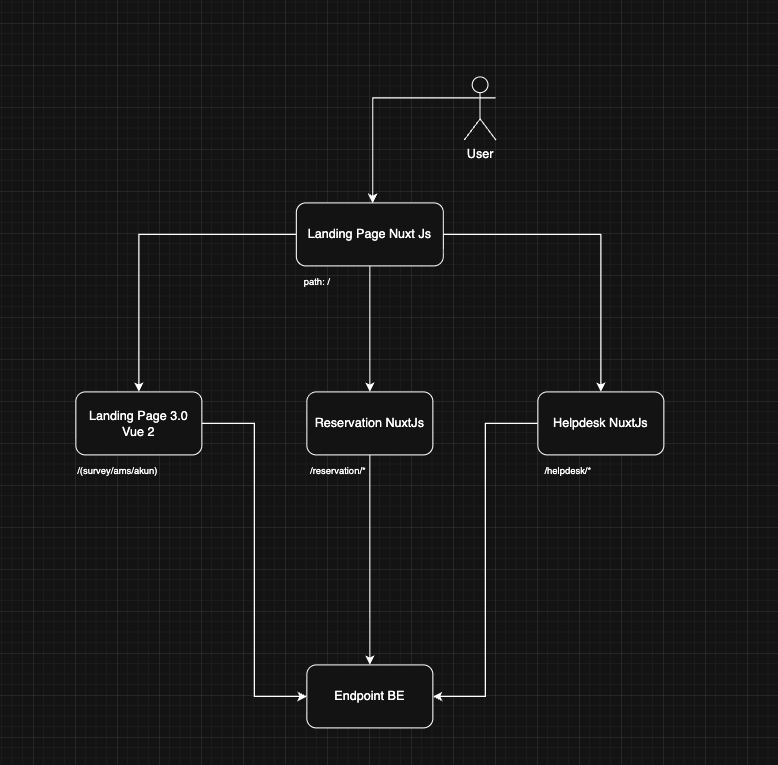

# Dokumentasi Setup Nginx — Frontend

## Gambaran Arsitektur



```
Internet
    │
    ▼
┌─────────────────────────────────────────┐
│  landing (port 3000)                    │
│  nuxt-landing-page + nginx.landing.conf │ ← satu-satunya yang expose ke luar
└──────────────┬──────────────────────────┘
               │ docker-compose internal network (bsre-net)
       ┌───────┼────────────┬─────────────────────────┐
       ▼       ▼            ▼                         ▼
  landingpage  helpdesk  reservation        backend services
  :80          :80       :80                (APP_* env vars)
  Vue CLI SPA  Nuxt SPA  Nuxt SPA
```

Hanya container `landing` yang membuka port ke luar (3000:80). Container lain hanya `expose` port internal dan tidak dapat diakses langsung dari luar network Docker.

---

## File-file Nginx

| File | Digunakan oleh | Tujuan |
|------|---------------|--------|
| `nginx.landing.conf` | `Dockerfile` (container `landing`) | Dev/static — tanpa env vars |
| `nginx.landing.conf.template` | `Dockerfile` (diproses `envsubst`) | Produksi — dengan variabel `APP_*` |
| `nginx.landingpage.conf` | `Dockerfile.landingpage` (container `landingpage`) | Melayani Vue CLI SPA landingpage-3.0 |
| `nginx.subapp.conf` | `Dockerfile.helpdesk` & `Dockerfile.reservation` | Dev/static untuk kedua sub-app Nuxt |
| `nginx.subapp.conf.template` | `Dockerfile.helpdesk` & `Dockerfile.reservation` (envsubst) | Produksi untuk kedua sub-app Nuxt |

---

## Direktif Global (berlaku di semua file)

### Worker dan Koneksi

```nginx
worker_processes  auto;
```
Nginx membuat worker process sebanyak jumlah CPU core yang tersedia secara otomatis.

```nginx
worker_connections 1024;
```
Maksimum koneksi simultan per worker process. Total kapasitas = `worker_processes × worker_connections`.

### Logging

```nginx
error_log /var/log/nginx/error.log warn;
```
Log error pada level `warn` ke atas (warn, error, crit, alert, emerg).

```nginx
log_format main "...";
access_log /var/log/nginx/access.log main;
```
Format log akses standar: IP klien, waktu, request, status HTTP, ukuran body, referer, user-agent.

### HTTP Umum

```nginx
include       /etc/nginx/mime.types;
default_type  application/octet-stream;
```
Memuat mapping ekstensi file → Content-Type. Fallback ke binary stream untuk tipe tidak dikenal.

```nginx
sendfile        on;
```
Menggunakan syscall `sendfile()` kernel untuk transfer file langsung dari disk ke socket tanpa menyalin ke user-space — lebih efisien untuk melayani aset statis.

```nginx
keepalive_timeout 65;
```
Koneksi TCP tetap terbuka selama 65 detik setelah request selesai, memungkinkan request HTTP berikutnya menggunakan koneksi yang sama.

```nginx
client_max_body_size 10M;   # landing & subapp
client_max_body_size 50M;   # template (upload file lebih besar)
```
Batas maksimum ukuran request body. Request yang melebihi batas ini dibalas dengan `413 Request Entity Too Large`.

```nginx
server_tokens off;
```
Menyembunyikan versi Nginx dari header `Server` dan halaman error. Mengurangi informasi yang terekspos ke penyerang.

---

## nginx.landing.conf — Gateway Utama (Dev)

Container `landing` adalah pintu masuk tunggal dari internet. Nginx di sini bertugas sebagai **reverse proxy** yang mendistribusikan request ke container internal yang tepat.

### Urutan Pencocokan Location

Nginx mencocokkan location dalam urutan prioritas berikut:
1. `=` exact match (tertinggi)
2. `^~` prefix match — blokir regex, lanjut ke aturan berikutnya jika cocok
3. `~` / `~*` regex match (diuji berurutan)
4. `/` default prefix match (terendah)

### Location Blocks

#### `/helpdesk` → container `helpdesk:80`

```nginx
location ^~ /helpdesk {
  proxy_pass http://helpdesk:80/helpdesk;
  ...
}
```

**Mengapa `^~`?**
Modifier `^~` memastikan semua path yang diawali `/helpdesk` — termasuk `/helpdesk/_nuxt/chunk.js`, `/helpdesk/favicon.ico` — diproses di sini dan **tidak diteruskan ke blok regex** `~* \.(js|css|...)$` di bawah. Tanpa `^~`, aset Nuxt seperti `_nuxt/*.js` akan tertangkap blok static asset dan dikembalikan dari disk landing (yang tidak memiliki file tersebut) alih-alih di-proxy ke container helpdesk.

**Mengapa path tujuan ikut `/helpdesk`?**
Container `helpdesk` menjalankan nginx-nya sendiri (`nginx.subapp.conf`) yang menerima request dengan prefix `/helpdesk` dan kemudian merewrite-nya. Jika proxy_pass ditulis `http://helpdesk:80` (tanpa `/helpdesk`), container penerima akan menerima path `/instansi` bukan `/helpdesk/instansi` dan rewrite rules tidak akan berjalan.

**Header proxy:**

| Header | Nilai | Fungsi |
|--------|-------|--------|
| `Host` | `$host` | Meneruskan hostname asli klien ke upstream |
| `X-Real-IP` | `$remote_addr` | IP asli klien (sebelum melewati proxy) |
| `X-Forwarded-For` | `$proxy_add_x_forwarded_for` | Rantai IP seluruh proxy yang dilewati |
| `X-Forwarded-Proto` | `$scheme` | Protokol asli (`http`/`https`) |
| `proxy_cache_bypass` | `$http_upgrade` | Bypass cache saat ada header Upgrade (WebSocket) |

#### `/reservation` → container `reservation:80`

```nginx
location ^~ /reservation {
  proxy_pass http://reservation:80/reservation;
  ...
}
```

Logika identik dengan `/helpdesk`. Modifier `^~` dan path tujuan berlaku dengan alasan yang sama.

#### Page routes landingpage-3.0

```nginx
location ~* ^/(tiket/survey|kegiatan|registrasi-kerjasama|kerjasama|email|bsre)/ {
  proxy_pass http://landingpage:80;
  ...
}
```

`~*` berarti regex case-insensitive. Daftar path ini sesuai dengan pola yang didefinisikan di `bsre-page-proxy.ts` — halaman-halaman yang dirender oleh aplikasi Vue CLI lama (landingpage-3.0), bukan oleh nuxt-landing-page.

Contoh aliran request:
- `GET /kegiatan/detail/123` → `http://landingpage:80/kegiatan/detail/123`
- `GET /kerjasama/form` → `http://landingpage:80/kerjasama/form`

#### Aset runtime landingpage-3.0

```nginx
location ~* ^/(css|js|img|dist)/ {
  proxy_pass http://landingpage:80;
  ...
}
```

Vue CLI SPA menghasilkan aset dengan path seperti `/js/app.hash.js`, `/css/chunk.css`, `/img/logo.png`. Path-path ini perlu di-proxy ke container `landingpage` — bukan diambil dari disk container `landing`.

#### Aset statis nuxt-landing-page

```nginx
location ~* \.(js|css|png|jpg|jpeg|gif|ico|svg|woff2?|ttf|eot)$ {
  expires 1y;
  add_header Cache-Control "public, immutable";
  try_files $uri =404;
}
```

Aset milik nuxt-landing-page sendiri (di-copy ke `/usr/share/nginx/html` saat build Docker). Dikembalikan langsung dari disk dengan cache agresif:
- `expires 1y` — browser cache selama 1 tahun
- `Cache-Control: public, immutable` — CDN/proxy boleh cache, file tidak akan berubah (hash-based filenames)
- `try_files $uri =404` — jika file tidak ada, langsung 404 (tidak fallback ke SPA)

**Mengapa ini tidak menangkap aset `/helpdesk/_nuxt/*.js`?**
Karena blok `^~ /helpdesk` diproses lebih awal dan `^~` menghentikan evaluasi regex.

#### SPA Fallback

```nginx
location / {
  try_files $uri $uri/ /index.html;
}
```

Menangani semua path yang tidak cocok dengan blok di atas. Urutan `try_files`:
1. `$uri` — coba file exact (misal `/favicon.ico`)
2. `$uri/` — coba sebagai direktori dengan `index.html`
3. `/index.html` — fallback ke entry point SPA

Ini memungkinkan client-side routing Nuxt bekerja — semua path yang tidak dikenal dikembalikan ke `index.html` dan router Nuxt yang menangani navigasinya.

#### Error page

```nginx
error_page 403 404 /index.html;
```

Error 403 (Forbidden) dan 404 (Not Found) diarahkan ke `index.html` agar SPA bisa menampilkan halaman error custom sendiri.

---

## nginx.landing.conf.template — Gateway Utama (Produksi)

File ini identik dengan `nginx.landing.conf` untuk semua blok proxy internal (`/helpdesk`, `/reservation`, landingpage routes). Perbedaannya adalah tambahan blok proxy ke **backend service eksternal** menggunakan variabel lingkungan `APP_*`.

### Resolver Docker

```nginx
resolver 127.0.0.11 valid=30s ipv6=off;
```

**Wajib** ketika `proxy_pass` menggunakan variabel (`$proxy_uri`). Nginx secara default me-resolve hostname upstream saat startup. Ketika menggunakan variabel, resolusi terjadi per-request — membutuhkan resolver DNS eksplisit. `127.0.0.11` adalah DNS internal Docker Compose. `valid=30s` berarti cache DNS di-refresh setiap 30 detik.

### Pola Proxy ke Backend Eksternal

Semua blok API backend menggunakan pola yang sama:

```nginx
location ^~ /_reservation/ {
  set $suffix $uri$is_args$args;
  if ($suffix ~ "^/_reservation/(.*)$") { set $suffix /$1; }
  set $proxy_uri ${APP_RESERVASI}$suffix;
  proxy_pass $proxy_uri;
  ...
  proxy_ssl_server_name on;
}
```

**Mengapa menggunakan `set $proxy_uri` dan bukan `proxy_pass` langsung?**

Jika `proxy_pass` ditulis langsung dengan URL statis, nginx melakukan built-in URI rewriting yang memotong prefix location. Ketika nilai tujuan berasal dari variabel `APP_*` yang sudah mengandung path backend-nya sendiri, built-in rewriting ini merusak URL akhir. Dengan menyimpan URL ke variabel terlebih dahulu, nginx memperlakukannya sebagai literal — tidak ada rewriting otomatis.

**Langkah-langkah konstruksi URL:**

1. `set $suffix $uri$is_args$args` — gabungkan path + `?` + query string
2. `if ($suffix ~ "^/_reservation/(.*)$") { set $suffix /$1; }` — strip prefix `/_reservation`, sisakan hanya path setelahnya (dimulai dengan `/`)
3. `set $proxy_uri ${APP_RESERVASI}$suffix` — gabungkan base URL backend + path yang sudah di-strip

Contoh dengan `APP_RESERVASI=https://internal-dev.bsre.go.id/reservasi-service`:
```
Request:    GET /_reservation/api/booking?id=5
$suffix:    /_reservation/api/booking?id=5
→ strip:    /api/booking?id=5
$proxy_uri: https://internal-dev.bsre.go.id/reservasi-service/api/booking?id=5
```

**`proxy_ssl_server_name on`** — dibutuhkan ketika upstream menggunakan HTTPS dengan SNI (Server Name Indication). Memastikan nama host dikirim dalam handshake TLS sehingga server yang meng-host banyak domain tahu sertifikat mana yang harus digunakan.

**Perbedaan `Host` header:**

| Blok | Host header |
|------|-------------|
| Proxy ke container internal | `$host` (hostname klien asli) |
| Proxy ke backend eksternal | `$proxy_host` (hostname backend tujuan) |

Backend eksternal membutuhkan `$proxy_host` agar virtual hosting mereka bekerja dengan benar.

### Tabel Endpoint Backend

| Location | Env Var | Default (dev) | Fungsi |
|----------|---------|---------------|--------|
| `/_reservation/` | `APP_RESERVASI` | `reservasi-service` | API pemesanan/reservasi |
| `/api/_kerjasama/` | `APP_KERJASAMA` | `kerjasama-service` | API kerja sama instansi |
| `/api/persuratan/` | `APP_PERSURATAN` | `servispersuratan` | API surat-menyurat |
| `/_persuratan/` | `APP_PERSURATAN` | `servispersuratan` | API surat-menyurat (path alternatif) |
| `/_monitoring/` | `APP_MONITORING` | `report-service` | API monitoring & laporan |
| `/api/wilayah/` | `APP_WILAYAH` | `data-wilayah` | API data wilayah Indonesia |
| `/api/ams/` | `APP_AMS` | `ams-core-2` | API Access Management System |
| `/_survey/` | `APP_SURVEY` | `survey-service` | API survey (legacy path) |
| `/api/_survey/` | `APP_SURVEY` | `survey-service` | API survey |
| `/api/_publik/` | `APP_PUBLIK` | `publicwebgateway` | API data publik/gateway |
| `/_tiket/` | `APP_HELPDESK` | `crm-web-gateway` | API helpdesk/tiket |
| `/api/_tiket/` | `APP_HELPDESK` | `crm-web-gateway` | API helpdesk/tiket |

**Konvensi penamaan prefix:**
- Prefix `/_nama/` atau `/api/_nama/` digunakan untuk API backend service internal
- Underscore (`_`) membedakan API endpoint dari path halaman (yang tanpa underscore)
- Beberapa service memiliki dua prefix untuk kompatibilitas klien lama dan baru

---

## nginx.landingpage.conf — Container landingpage-3.0

Container ini hanya dapat diakses dari dalam network Docker (`bsre-net`) — tidak ada port yang di-expose ke luar.

### Location Blocks

#### API Survey via container `landing`

```nginx
location ^~ /_survey/ {
  proxy_pass http://landing:80;
  ...
}

location ^~ /api/_survey/ {
  proxy_pass http://landing:80;
  ...
}
```

Aplikasi Vue CLI lama memanggil API survey dengan path `/_survey/` atau `/api/_survey/`. Container `landingpage` tidak langsung terhubung ke backend — ia meneruskan request ini kembali ke container `landing` yang memiliki blok `APP_SURVEY` dan resolver untuk meneruskan ke backend sesungguhnya.

Aliran: `klien → landing → landingpage → landing → backend survey`

#### Aset Statis

```nginx
location ~* \.(js|css|png|jpg|jpeg|gif|ico|svg|woff2?|ttf|eot)$ {
  expires 1y;
  add_header Cache-Control "public, immutable";
  try_files $uri =404;
}
```

Cache agresif untuk aset yang nama filenya sudah mengandung hash.

#### SPA Fallback

```nginx
location / {
  try_files $uri $uri/ /index.html;
}
```

Standard SPA fallback — semua path yang tidak dikenal dikembalikan ke `index.html`.

---

## nginx.subapp.conf — Sub-app Nuxt (Dev)

Digunakan oleh container `helpdesk` dan `reservation`. Menangani quirk khusus melayani Nuxt SPA yang di-build dengan `baseURL` sub-path (`/helpdesk` atau `/reservation`) tapi file statis disimpan flat di `/usr/share/nginx/html/`.

### absolute_redirect off

```nginx
absolute_redirect off;
```

Secara default, jika nginx menemukan direktori (misal request ke `/instansi`), ia mengeluarkan redirect 301 ke `/instansi/`. Dengan `absolute_redirect off` dikombinasikan dengan `try_files` yang mengecek `$uri/index.html` (bukan `$uri/`), redirect ini tidak terjadi — nginx langsung cek file `index.html` di dalam direktori tersebut.

### Strip Prefix Routing

```nginx
location ~ ^/(reservation|helpdesk)(/.+)$ {
  rewrite ^/(reservation|helpdesk)(/.+)$ $2 last;
}
location ~ ^/(reservation|helpdesk)/?$ {
  rewrite ^ / last;
}
```

Container ini menerima request dari `landing` dengan path penuh. Contoh transformasi:
- `GET /reservation/instansi` → rewrite → `GET /instansi`
- `GET /reservation/_nuxt/app.js` → rewrite → `GET /_nuxt/app.js`
- `GET /reservation/` → rewrite → `GET /`

Setelah rewrite, nginx mengevaluasi ulang request (flag `last`) dan menemukan file yang tepat di `/usr/share/nginx/html/`.

**Mengapa rewrite diperlukan?**
Nuxt di-build dengan `app.baseURL = '/reservation'`. Semua internal link dan aset menggunakan path `/reservation/...`. Tapi output `nuxt generate` menghasilkan file flat di root direktori — tidak ada subdirektori `/reservation/`. Rewrite menjembatani keduanya.

### SPA Fallback dengan $uri/index.html

```nginx
location / {
  try_files $uri $uri/index.html /index.html;
}
```

Perbedaan dari container `landing`: urutan kedua adalah `$uri/index.html` (bukan `$uri/`). Ini menghindari nginx mencoba membaca direktori (yang memicu 301 redirect) — langsung cek apakah ada `index.html` di dalam direktori tersebut, lalu fallback ke root `index.html`.

### Aset Statis (Extended)

```nginx
location ~* \.(js|css|png|jpg|jpeg|gif|ico|svg|woff2?|ttf|eot|json|map|txt|xml)$ {
```

Daftar ekstensi lebih panjang dibanding container lain — mencakup `.json`, `.map` (source maps), `.txt`, `.xml` yang dibutuhkan oleh Nuxt.

---

## nginx.subapp.conf.template — Sub-app Nuxt (Produksi)

Versi produksi dari `nginx.subapp.conf`. Menambahkan semua blok proxy API backend yang sama dengan `nginx.landing.conf.template`, ditambah satu blok rewrite khusus untuk helpdesk.

### Strip Base Path dari API Call Helpdesk

```nginx
location ~ ^/helpdesk(/_tiket/|/api/_tiket/|/_reservation/|/_monitoring/|...)(.*)$ {
  rewrite ^/helpdesk(/.*)$ $1 last;
}
```

Nuxt di-build dengan `baseURL = '/helpdesk'`. Saat kode Nuxt melakukan `$fetch('/_tiket/api/...')`, Nuxt secara internal menambahkan base URL sehingga request yang keluar menjadi `/helpdesk/_tiket/api/...`. Blok ini merewrite path tersebut menjadi `/_tiket/api/...` agar bisa ditangkap oleh blok `location ^~ /_tiket/` yang normal.

Tanpa rewrite ini, request API dari dalam aplikasi helpdesk akan gagal karena tidak ada blok yang cocok untuk path `/helpdesk/_tiket/...`.

### Blok API Backend

Semua endpoint API backend identik dengan `nginx.landing.conf.template` — lihat tabel di atas. Blok-blok ini dibutuhkan di sub-app karena ketika pengguna membuka `/helpdesk` atau `/reservation` dan melakukan request API, nginx sub-app yang menangani, bukan nginx `landing`.

---

## Variabel Lingkungan (APP_*)

Variabel ini di-inject saat container startup melalui `envsubst` yang memproses file `.template` menjadi konfigurasi nginx aktif.

| Variabel | Layanan | Keterangan |
|----------|---------|------------|
| `APP_RESERVASI` | reservasi-service | Backend manajemen reservasi/pemesanan |
| `APP_KERJASAMA` | kerjasama-service | Backend kerja sama antar instansi |
| `APP_PERSURATAN` | servispersuratan | Backend layanan surat-menyurat |
| `APP_MONITORING` | report-service | Backend monitoring dan pelaporan |
| `APP_WILAYAH` | data-wilayah | Backend data wilayah Indonesia |
| `APP_AMS` | ams-core-2 | Backend Access Management System |
| `APP_SURVEY` | survey-service | Backend layanan survey |
| `APP_PUBLIK` | publicwebgateway | Backend data publik/gateway |
| `APP_HELPDESK` | crm-web-gateway | Backend helpdesk/CRM tiket |

Nilai di `docker-compose.yml` berfungsi sebagai fallback development (`${VAR:-default}`). Di produksi, nilai nyata di-override melalui environment injection pada deployment.

---

## Ringkasan Aliran Request

```
GET /                          → landing nginx → try_files → index.html (nuxt-landing)
GET /kegiatan/acara            → landing nginx → landingpage:80 (Vue CLI SPA)
GET /js/app.abc123.js          → landing nginx → landingpage:80 (aset Vue CLI)
GET /helpdesk/dashboard        → landing nginx → helpdesk:80/helpdesk/dashboard
GET /helpdesk/_nuxt/app.js     → landing nginx (^~ blok) → helpdesk:80 → rewrite → /_nuxt/app.js
GET /reservation/kamar         → landing nginx → reservation:80/reservation/kamar
GET /_reservation/api/booking  → landing nginx → APP_RESERVASI/api/booking (backend eksternal)
GET /api/_tiket/list           → landing nginx → APP_HELPDESK/list (backend eksternal)
GET /_survey/submit            → landing nginx → APP_SURVEY/submit (backend eksternal)
```
